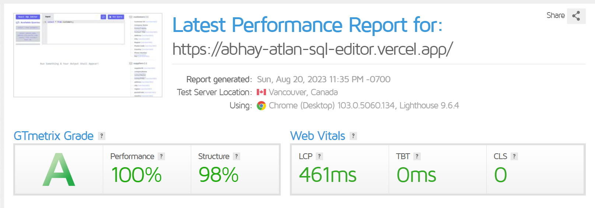
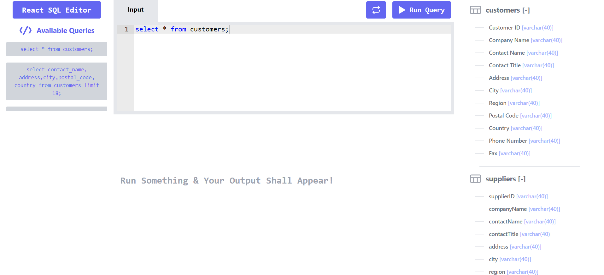

# REACT SQL EDITOR

This is a REACT SQL Editor built using ReactJs and TailwindCSS.

## 👨‍💻 Live

Links : [click here](https://abhay-atlan-sql-editor.vercel.app/)

## 👨‍🔧 Tech Stack

## ⚙️ Dependencies

- **_react-ace_**
- **_react-csv_**
- **_react-hot-toast_**
- **_tailwind-scrollbar-hide_**

## 👨‍💻 Features

:white_check_mark: Users can get data of any of the predefined SQL queries on the left Sidebar menu.\
:white_check_mark: Users can view all the table column on Right Sidebar menu.\
:white_check_mark: Users can check all the table value on clicking Table name of Right Sidebar menu.\
:white_check_mark: Users can download the data in CSV Format in just one click.\
:white_check_mark: Users can see query runtime in milliseconds(ms).

## Predefined SQL Queries

- `select * from customers;`
- `select * from suppliers;`
- `select * from products;`
- `select contact_name, address,city,postal_code, country from customers limit 18;`

## Page Load Time

Page Load time of this website in desktop is in the range of 0.4s to 0.6s and we have measured this time using GTmetrix Grade.

## 🪜 Steps I took to optimize the page load time

- Used Lighthouse DevTools Extension to find the performance issues and fix them using their actionable suggestion.
- Used vercel to deploy this website to leverage its Vercel Edge Network compression that results in the better performance.

## Available Scripts

In the project directory, you can run:

### `npm install`

To install all the packages in package.json. This will install all the dependencies and devDependencies.

### `npm start`

Runs the app in the development mode.\
Open [http://localhost:3000](http://localhost:3000) to view it in the browser.

The page will reload if you make edits.\
You will also see any lint errors in the console.

### `npm run build`

Builds the app for production to the `build` folder.\
It correctly bundles React in production mode and optimizes the build for the best performance.

## 🚀 Project Output

